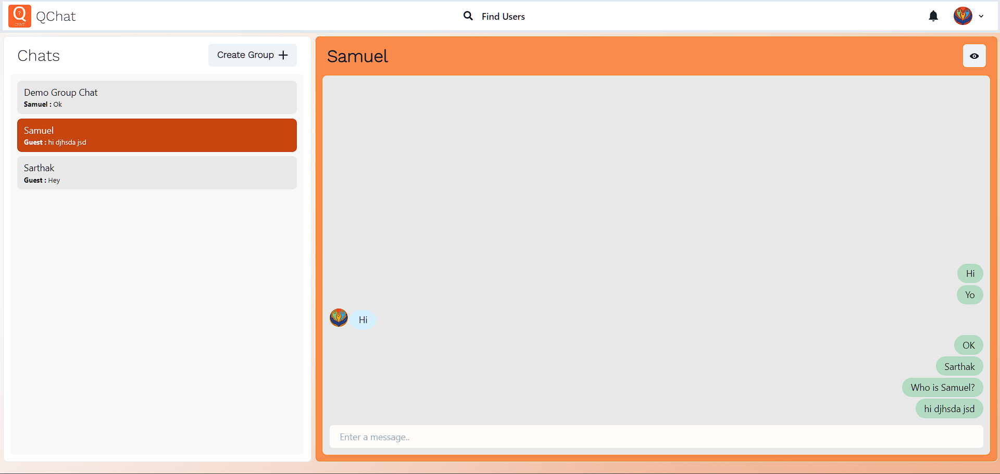
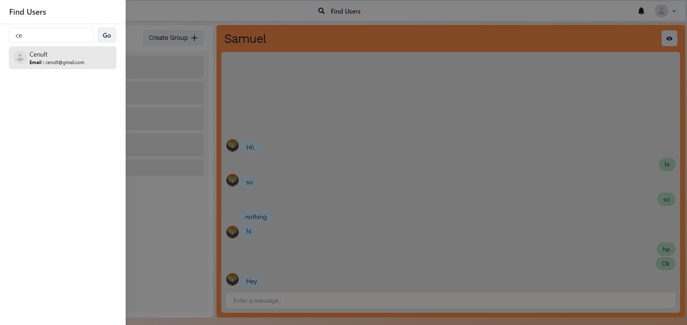
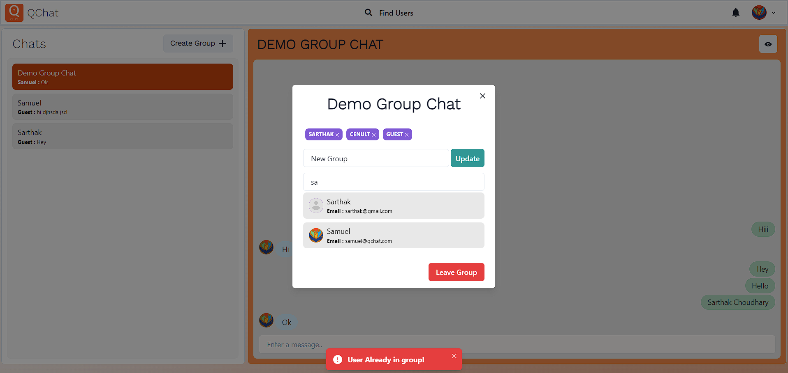
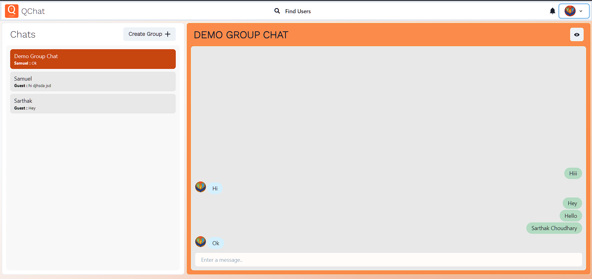
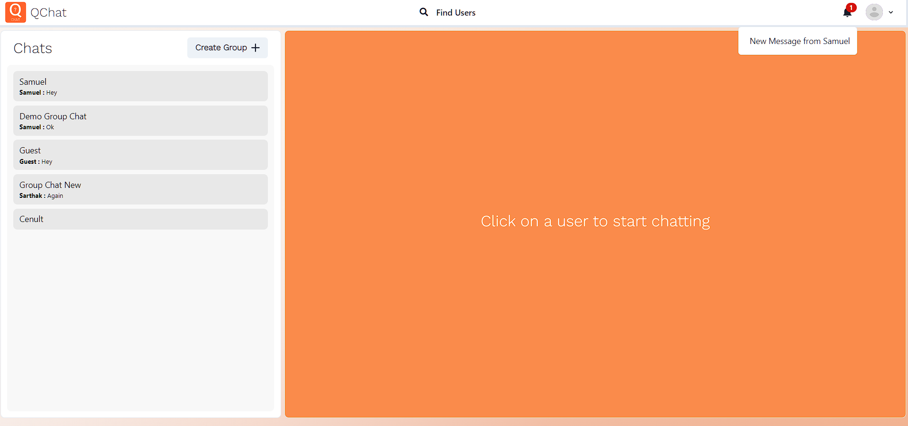
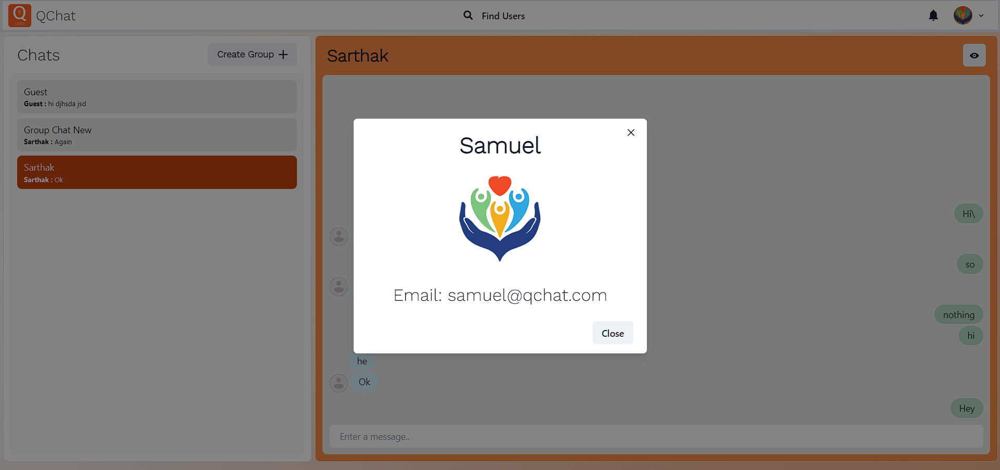

# QChat Messaging Service Prototype


QChat is a real-time messaging service prototype developed by [Your Name] for the internship opportunity with [Internship Company]. It aims to provide users with a user-friendly interface for real-time messaging and group chat functionality.

**College:** Your College Name  
**Department:** B.Tech in Computer Science and Engineering

## Table of Contents
- [QChat Messaging Service Prototype](#qchat-messaging-service-prototype)
  - [Table of Contents](#table-of-contents)
  - [Features](#features)
  - [Technologies Used](#technologies-used)
  - [Getting Started](#getting-started)
    - [Prerequisites](#prerequisites)
    - [Installation](#installation)
    - [Configuration](#configuration)
  - [Usage](#usage)
  - [Screenshots](#screenshots)

## Features

- Real-time messaging using WebSocket and Socket.io.
- User authentication with JWT.
- User-friendly interface using React and Chakra UI.
- MongoDB for data storage.
- Group chat functionality.
- Notifications for new messages.

## Technologies Used

- **Backend:**
  - Node.js
  - Express.js
  - Socket.io
  - MongoDB
  - JWT for authentication
  - bcrypt for password hashing

- **Frontend:**
  - React
  - Chakra UI
  - Socket.io-client
  - Axios for HTTP requests

## Getting Started

### Prerequisites

- Node.js and npm installed locally.
- MongoDB installed and running.


### Installation


1. Clone the repository
```bash
git clone https://github.com/Cenult/QChat.git
cd QChat
```

2. Navigate to the backend directory and install backend dependencies
```bash
cd backend
npm install
```

3. Create a `.env` file in the backend directory and set the following environment variables:
```bash
PORT=4000
DATABASE_URL=your-mongodb-database-url
JWT_SECRET_KEY=your-secret-key
NODE_ENV=development

```


4. Navigate to the frontend directory and install frontend dependencies
```bash
cd ../frontend
npm install
```

### Configuration
Detailed configuration instructions, including setting up a MongoDB database, can be found in the [System Design Document](link).

## Usage
1. Start the backend server:

```bash
cd backend
npm start
```

2. Start the frontend application:
```bash
cd ../frontend
npm start
```

3. Access the QChat messaging service:

Open your web browser and navigate to [http://localhost:3000](http://localhost:3000) to access the QChat messaging service.


## Screenshots






